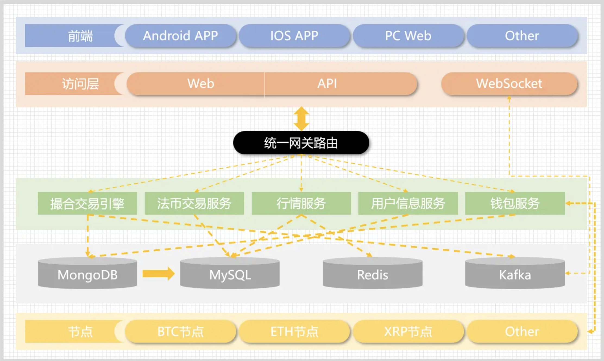
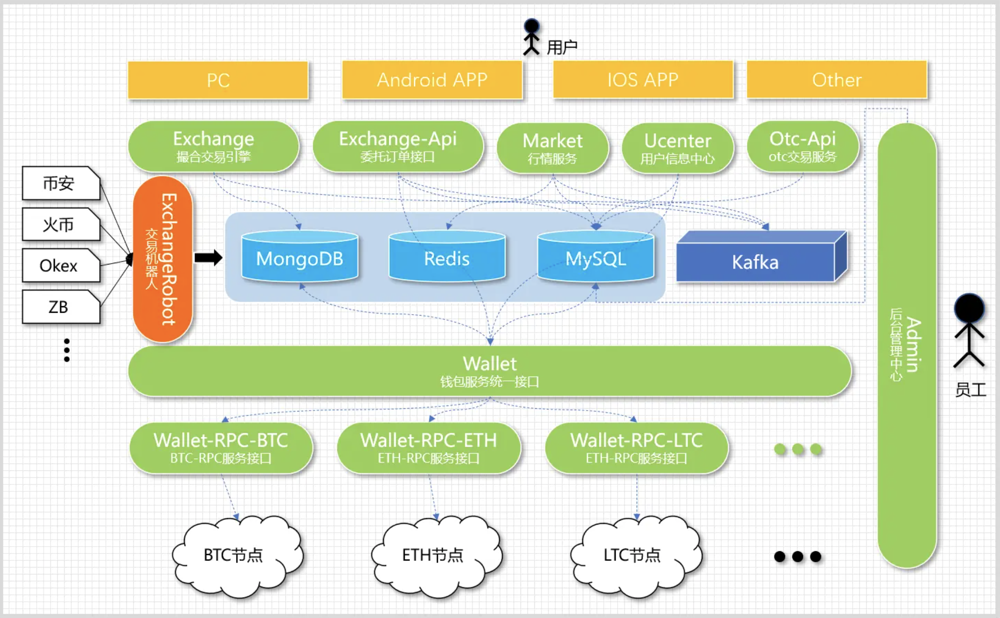
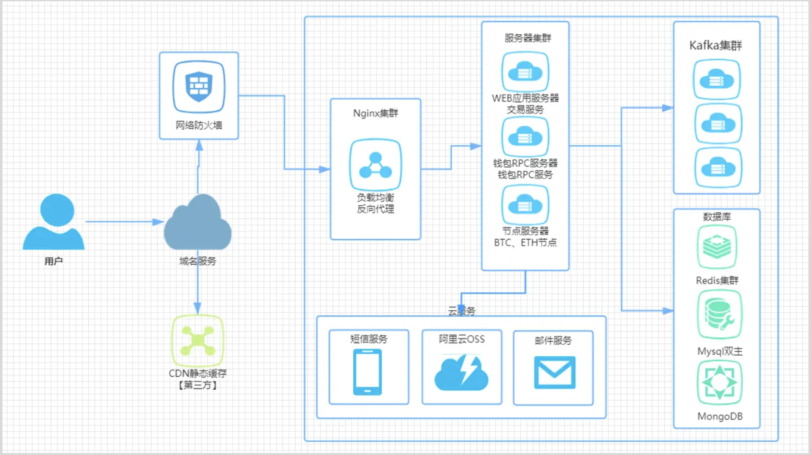
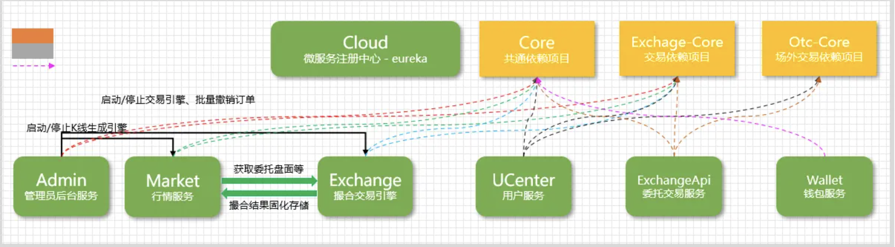

# C2E-Cex数字货币、永续合约交易系统

### 重要说明

1. 本项目是一个加密货币交易平台的演示项目，仅用于展示和学习目的。
2. 项目中的所有代码、文档和资源仅供学习参考，不得用于任何商业用途。
3. 本项目不提供任何投资建议，也不对任何投资决策负责。
4. 使用本项目时，请遵守当地法律法规。
5. 项目开发者不对使用本项目造成的任何损失负责。
6. 本项目不涉及真实资产交易，不推荐或倡导任何形式的金融活动

### 学习目的

- 了解加密货币交易平台的基本架构和相关业务
- 研究区块链和加密货币相关技术

## 项目介绍：
- C2E-Cex 旨在打造一家领先的数字资产交易所，为全球用户提供安全、高效、创新的金融服务。作为一家交易平台，我们注重用户隐私和资产安全，采用最先进的区块链技术，为用户提供更快、更便捷的交易体验。

- C2E-Cex 交易所将支持多种数字资产的交易，涵盖加密货币、代币化资产以及其他数字化资产。我们拥有币币兑换、永续合约、期权合约、秒合约以及创新理财等市场上前沿的功能，我们致力于为投资者提供多元化的投资选择，推动数字资产的创新与发展。
在合规方面，我们将积极配合全球金融监管，建立健全的法规框架，确保平台的合规运营。我们追求公正透明的市场环境，维护投资者的权益，为市场参与者提供稳定可靠的交易平台。
通过不断优化和创新，我们的愿景是成为全球领先的数字资产交易平台，为用户创造更多价值，推动金融科技的进步，促进数字经济的可持续发展。

## 警告：

##### 风险提示

1. 法定货币风险：
数字资产不是法定货币，其价值可能受到极大波动。投资者应当理性看待数字资产价格的变动，并注意市场风险。

2. 监管合规：
数字资产交易存在合规风险，不同平台可能面临监管政策的变化。投资者应选择合规的平台，了解并遵守相关法规，以保障自身权益。

3. 投资风险：
数字资产市场具有高度波动性，投资者可能面临资产损失的风险。在参与交易前，请仔细评估自身风险承受能力，并做好风险管理。

4. 非法平台警示：
提醒投资者远离未经授权或存在违法行为的数字资产平台，以防止遭受不法侵害。

5. 投资知识：
数字资产交易需要具备一定的投资知识，投资者应当不断学习，提高自身风险识别和应对能力。

6. 个人信息保护：
在选择数字资产交易平台时，注意平台对个人信息的保护措施，防范个人信息泄露风险。

7. 虚假宣传：
注意防范虚假宣传和不实信息，避免受到虚假交易平台的误导。

8. 资金安全：
保障资金安全是投资者的首要任务，选择有声誉、安全性高的数字资产交易平台进行交易。

##### 你需要知道的基本知识

- 法律知识（安全第一条，法律最重要） 
- Java 知识（主要是 spring） 
- linux 知识（CentOS、Ubuntu 等等） 
- 前端（Vue，Java） 
- 其他安全知识等等

##### 主要技术

- 后端：Spring、SpringMVC、SpringData、SpringCloud、SpringBoot 
- 数据库：Mysql、Mongodb 
- 其他：redis、rocketMq、阿里云 OSS、腾讯防水校验、环信推送 
- 前端：Vue 

## 整体架构
#### 

## 逻辑架构

#### 

## 部署架构

#### 

## 依赖关系

#### 

## 环境搭建

- Centos 7.6+
- MySQL 5.7.16+
- Redis 6.2.7
- Mongodb 4.0+
- rocketMq 4.4.0
- nginx-1.16.0+
- JRE 8u241
- JDK 1.8
- Vue

## 前端工程

1. **进入前端目录**：`cd cex-front`

2. **安装环境依赖**：`pnpm install` 或 `npm install` 或 `yarn install`

3. **本地启动前端工程**：`npm run serve`

4. **前端生产环境打包**：`npm run build:prod`

### 配置说明

#### 服务器API配置

开发环境配置.env.development
生产环境配置.env.production

后台部署后配置以下三个环境变量，分别代表后台不同服务的api

VUE_APP_UC_API_URL = ''
VUE_APP_EXCHANGE_API_URL = ''
VUE_APP_MARKET_API_URL= ''

例：
VUE_APP_UC_API_URL = 'http://{你的服务器IP地址}:6001'

## 后端工程

todo...